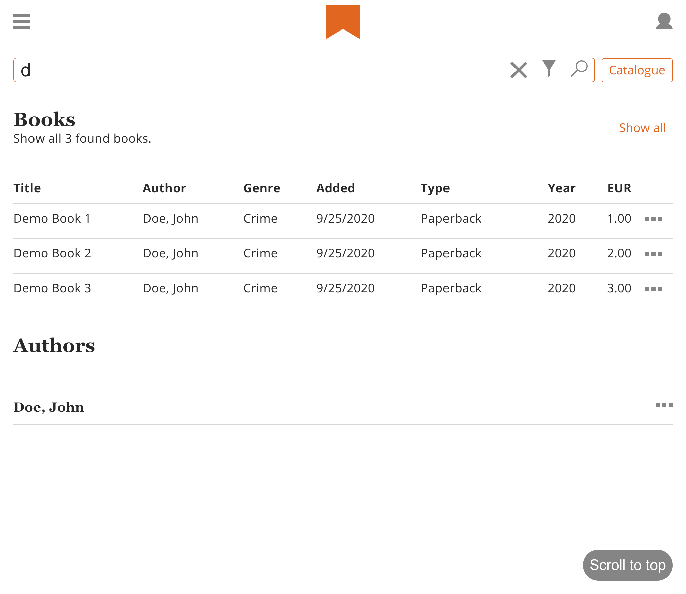

# incwadi

incwadi is a book database to manage a lot of books.



## How it was made

An article can be found here https://medium.com/@A.Baldeweg/i-was-trying-new-things-accf33792e86

## Future

The first goal is to make a minimum viable product (MVP). It delivers only the features actually needed to be usable. As soon as this is done version 1.0.0 will be released. After that I will start developing new features. The development will follow the principles of lean development. Building small features, try it and decide weather it makes sense to invest more time into it.

I hope people will help in testing out the app as users or getting involved into development. Since the languages (PHP, JavaScript) and the used tools are widespread, it should be easy to getting onboard.

## Getting Started

- Download the files from https://gitlab.com/a.baldeweg/incwadi_staff
- The files in dest/ should be located in your web root.
- Configure your webserver to redirect all requests to the index.html

Example for Apache

```apache
<IfModule mod_rewrite.c>
  RewriteEngine On
  RewriteBase /
  RewriteRule ^index\.html$ - [L]
  RewriteCond %{REQUEST_FILENAME} !-f
  RewriteCond %{REQUEST_FILENAME} !-d
  RewriteRule . /index.html [L]
</IfModule>
```

## Update

- Remove the old files and download the new ones like you would install the app.

## Dev

Run `yarn watch` to start the development environment.

## Tests

The command `yarn test` runs the unit tests.

## Build

Run `yarn build` to build the script.

## .env

The .env files specify default vars. You must define them for production by creating a more specific .env.production file.

```shell
touch .env.production
```

### Options

API - Defines the URL to your API.
